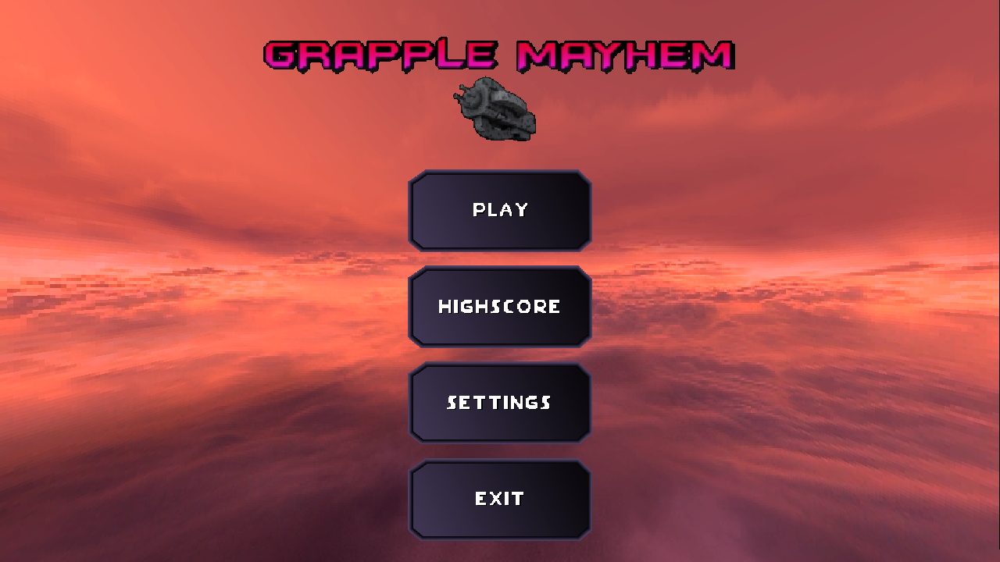
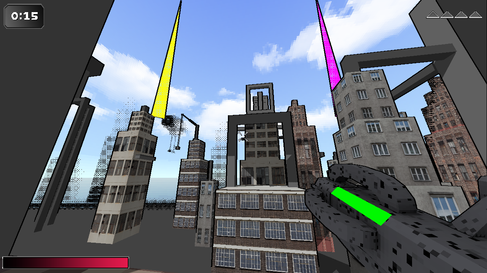
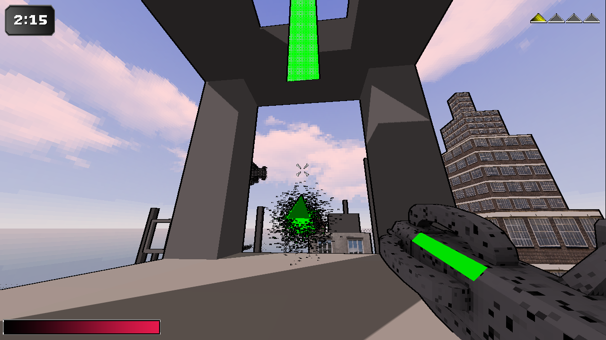
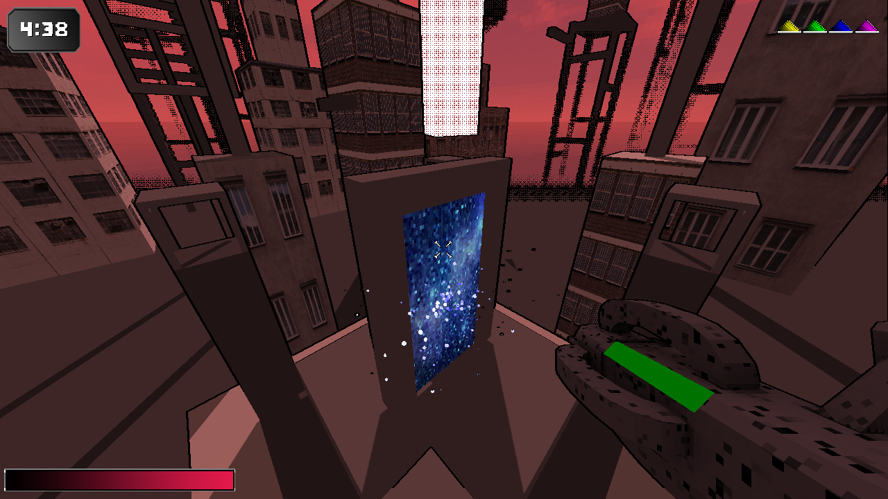
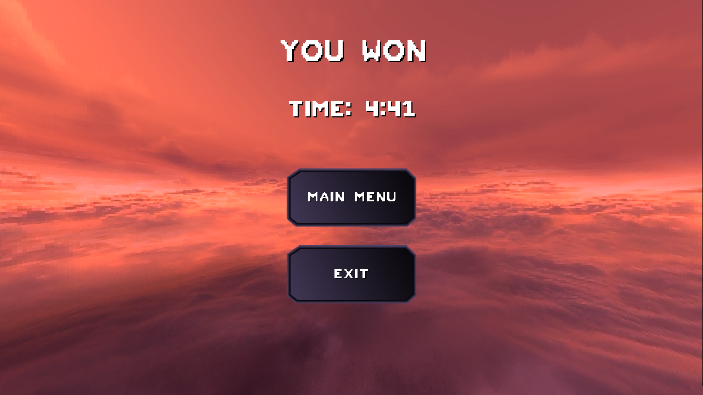

# Grapple Mayhem
A small game about collecting keys to a portal. The player has a grappling hook and a pulse cannon to traverse the map. [Trailer can be found here.](https://drive.google.com/file/d/1JpgOtOUMuuPeV_nibfomrBeAsp5E1YKn/view)

# Features
* Responsive UI
* "UI Translator" to correctly transform UI elements between different aspect ratios and resolutions
* Dithering and Outlines to give a more distinct art style, inspired by ps1 graphics
* Shadowmapping which is affected by the graphics quality setting
* Player movement and tools using [ReactPhysics3D](https://www.reactphysics3d.com/)
* FoV change with movement speed
* GPU-based particle systems, using instancing
* Dynamic skybox which is tinted during gameplay
* Skeletal animations
* Level parser - We use [Blender](https://www.blender.org/) to edit our level, and a custom level parser interprets submeshes as different gameplay elements (meshes, colliders, keys, etc.)

# Contributors
While everyone worked on a lot of different aspects in the project, our main contributions can be summarized as follows:
* Simon Hultsborn - Rendering and level parsing
* William Kamnert - Entity components and physics implementation
* Martin Johansson - Particle systems and gameplay elements
* Joel Berg - Menus and UI elements

# Screenshots

